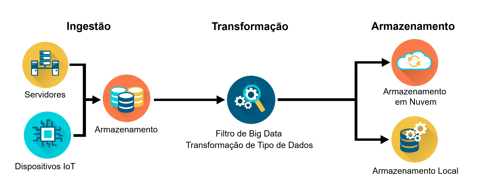

## Análise de Experiência

### Tipos de Gráficos
#### Gráficos de linhas
Gráficos de linhas são um dos tipos mais comumente utilizados para comparar dois conjuntos de dados. Utilize gráficos de linhas quando o número de pontos de dados for elevado e quando você desejar mostrar uma tendência nos dados ao longo do tempo. 
Casos de uso para gráficos de linhas:
As vendas trimestrais de uma empresa nos últimos cinco anos. 
O número de clientes por semana no primeiro ano de uma nova loja de varejo.
Mudanças no preço de uma ação desde a abertura até o fechamento. 
Práticas recomendadas para gráficos de linhas:
Rotule os eixos e as linhas de referência usadas para medir as coordenadas do gráfico. É comum traçar o tempo no eixo x (horizontal) e os valores de dados no eixo y (vertical).  
Use uma linhas contínua para conectar os pontos de dados para ilustrar as tendências. 
Mantenha mínimo o número de linhas plotadas, normalmente não mais de 5, para que o gráfico não fique confuso e difícil de ler.
Adicione uma legenda, uma pequena representação visual dos dados do gráfico, que informa o que cada linhas representa para ajudar o público a entender o que está visualizando. 
Sempre adicione um título.  

#### Gráficos da Coluna
Os gráficos de colunas são posicionados verticalmente, conforme mostrado na figura. Provavelmente, são o tipo de gráfico mais comumente usado para exibir o valor numérico de um ponto de dados específico e comparar esse valor entre categorias semelhantes. Eles permitem a fácil comparação entre vários pontos de dados.  
Casos de uso para gráficos de colunas:
Receita por país, conforme mostrado no exemplo de gráfico. 
Vendas do ano passado para as quatro principais empresas automobilísticas nos Estados Unidos. 
Pontuações médias dos testes dos alunos para cada uma das seis aulas de matemática. 
Práticas recomendadas para gráficos de colunas:
Rotule os eixos. 
Se o gráfico mostrar alterações ao longo do tempo, trace os incrementos de tempo no eixo x. 
Se o tempo não fizer parte dos dados, considere ordenar as alturas das colunas em ordem crescente ou decrescente para demonstrar mudanças ou tendências.  
Mantenha o número de colunas baixo, normalmente não mais de 7, para que o visualizador possa ver o valor de cada coluna.  
Inicie o valor do eixo y em zero para refletir com precisão o valor total da coluna. 
O espaçamento entre as colunas deve ser aproximadamente metade da largura de uma coluna. 

#### Gráficos de barras
Os gráficos de barras são semelhantes aos gráficos de colunas, exceto que os dados são exibidos horizontalmente. Os gráficos de barras também permitem uma comparação fácil entre vários pontos de dados. Os rótulos dos pontos de dados no gráfico de barras horizontais estão no lado esquerdo e são mais legíveis quando o rótulo contém texto em vez de valores. 
Casos de uso para gráficos de barras:
Produto interno bruto (PIB) das 25 nações com maior faturamento. 
O número de carros em uma concessionária vendidos por cada representante de vendas.
As pontuações na prova para cada aluno em uma turma de matemática. 
Melhores práticas para gráficos de barras:
Rotule os eixos. 
Considere ordenar as barras de modo que os comprimentos vão do maior para o menor. O tipo de dados provavelmente determinará se a barra mais longa deve estar na parte inferior ou superior para melhor ilustrar o padrão ou tendência pretendida.
Inicie o valor do eixo x em zero para refletir com precisão o valor total das barras.
O espaçamento entre as barras deve ser aproximadamente metade da largura de uma barra. 

#### Gráficos de Pizza
Os gráficos de pizza mostram partes de um todo. Cada fatia, ou segmento, da “torta” representa uma porcentagem do número total. A soma total dos segmentos deve ser igual a 100%. Um gráfico de pizza exibe os diferentes valores de uma determinada variável. Alguns casos de uso que ilustram a comparação das informações com um gráfico de pizza incluem:
Categorias de despesas anuais para uma empresa (por exemplo, aluguel, administrativo, serviços públicos, produção)
As fontes de energia de um país (por exemplo, petróleo, carvão, gás, solar, eólica)
Resultados de pesquisa para tipo de filme favorito (por exemplo, ação, romance, comédia, drama, ficção científica)
Algumas práticas recomendadas para gráficos de pizza incluem:
Mantenha o número de categorias mínimo para que o espectador possa diferenciar entre os segmentos. Depois de dez segmentos, as fatias começam a perder significado e impacto. Se necessário, consolide segmentos menores em um segmento com um rótulo como "Outros" ou "Diversos". 
Utilize uma cor diferente ou tons de escala de cinza para cada segmento. 
Ordene os segmentos de acordo com o tamanho. 
Certifique-se de que o valor de todos os segmentos somados seja igual a 100%. 

#### Gráficos de dispersão
Os gráficos de dispersão são muito populares para visualizações de correlação ou quando você deseja mostrar a distribuição, ou todos os valores possíveis, de um grande número de pontos de dados. Os gráficos de dispersão também são úteis para demonstrar o agrupamento ou identificar valores discrepantes nos dados. Alguns casos de uso que ilustram a visualização da distribuição de muitos pontos de dados com um gráfico de dispersão incluem:
Comparação das expectativas de vida dos países com seus PIBs (Produto Interno Bruto).
Comparação das vendas diárias de sorvete com a temperatura externa média em vários dias.
Comparação do peso com a altura de cada pessoa em um grupo grande. 
Algumas práticas recomendadas para gráficos de dispersão incluem:
Rotular os eixos. 
Certifique-se de que o conjunto de dados seja grande o suficiente para fornecer visualização de agrupamentos ou valores atípicos. 
Inicie o valor do eixo y em zero para representar os dados com precisão. O valor do eixo x dependerá dos dados. Por exemplo, as faixas etárias podem ser rotuladas no eixo x. 
Considere adicionar uma linhas de tendência se um gráfico de dispersão mostrar uma correlação entre os eixos x e y.
Não use mais de duas linhas de tendência. 

## Compreendendo Big Data
- Termo usado para descrever grandes volumes de dados digitais gerados, coletados e processados. Dados que se movem rapidamento, são apenas muito grandes ou muito complexos. Ex: dados gerados por contas de mídia social, dados de e-commerce.
- Suas características mudam a forma como os dados são coletados, transmitidos, armazenados e acessados.

### 4Vs do Big Data e seus Desafios
- Escala de dados (volume): descreve a quantidade de dados transportados e armazenados, de acordo com o IDC, descobrir maneiras de processar as quantidades crescentes de dados gerados a cada dia é um desafio.
- Formato de dados (variedade): forma que os dados podem assumir, a maioria provém de dados não estruturados, como vídeos, imagens. Sendo assim, são complexos para as arquiteturas tradicionais de armazenamento de data warehouse.
- Análise de fluxo de dados (velocidade): taxa a qual os dados são gerados. Desse modo, a infraestrutura de dados deve responder instantaneamente às demandas das aplicações que acessam e transmitem os dados.
- Incerteza de dados (veracidade): impedir que dados imprecisos estraguem os conjuntos de dados, o aumento da veracidade na coleta de dados pode reduzir a quantidade de limpeza de dados necessária.

### Impulsionadores de crescimento de dados
1. Proliferação de dispositivos da Internet das Coisas (IoT)
2. Maior acesso à internet, maior acesso à banda larga
3. Uso de smartphones 
4. Popularidade das redes sociais

### Gestão de Big Data

#### Pipelines de Dados
- Gerenciamento de dados - o processo inclui: desenvolvimento de infraestrutura e sistemas para ingerir os dados, limpá-los, transformá-los e por fim armazená-los de forma a facilitar o acesso e a consulta dos dados para o restante das pessoas na empresa para responder perguntas comerciais.
- O que é um pipeline? 
    - Ingestão, Transformação e Armazenamento ou ETL (Extract, Transform and Load)
    - Processamento: duas fontes principais de dados, lotes de servidores ou bancos de dados (ingestão de lote) e eventos em tempo real e streaming do mundo dos dispositivos (ingestão de streaming)
    - Transformação: dados precisam ser limpos, ou seja, remover valores nulos, datas no formato correto e dados desatualizados rapidamente. A estrutura deve se alinhar com o sistema necessário para manter análises precisas
    - Armazenamento: precisam ser armazenados em locais e formulários, facilitando a execução de relatórios sobre vendas semanais e para os cientistas de dados para criar modelos de recomendação preditivos. Além da segurança e gerenciamento de acesso a dados. O armazenamento pode ser local ou em nuvem ou híbridos.
